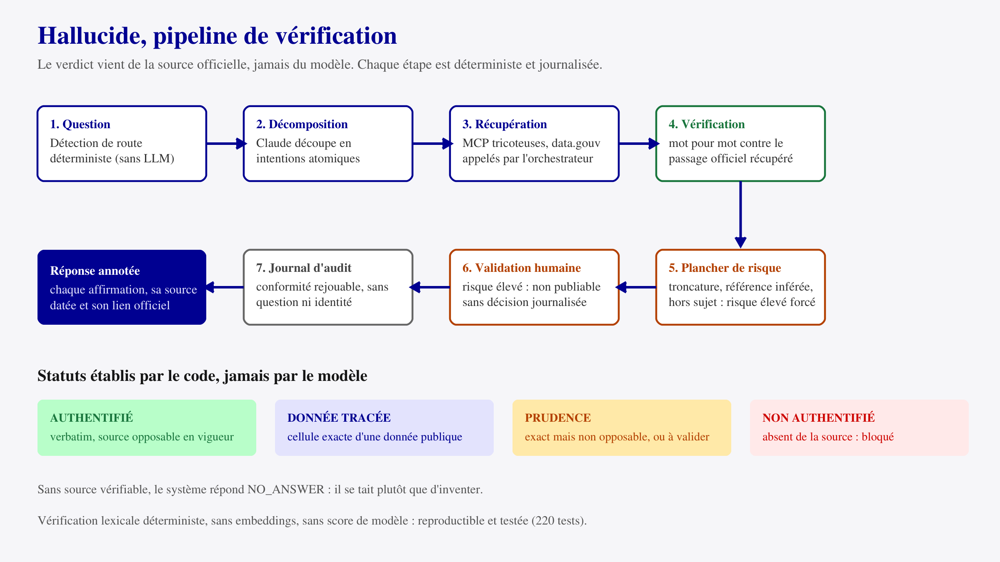

# DEFI.md

### Nom du défi
Hallucide

### Description courte
Hallucide vérifie les réponses d'une IA générative contre les sources officielles du Parlement. Chaque affirmation est confrontée mot pour mot au passage source et affichée annotée : vérifiée, tracée, prudence ou risque.

### Porteur
Équipe Hallucide

### Description longue
Les IA génératives produisent des réponses inexactes ou non sourcées, et hallucinent jusqu'à leurs propres justifications. En contexte institutionnel, distinguer une information vérifiée d'un contenu généré est difficile.

Hallucide est une couche de confiance entre le modèle et l'utilisateur. La réponse du modèle est interceptée avant affichage, découpée en affirmations élémentaires, puis chaque affirmation est confrontée à l'open data officiel : articles de code consolidés, questions parlementaires, mandats et commissions des députés, données tabulaires data.gouv.fr. La réponse n'est affichée qu'annotée. Ce que le système ne peut pas sourcer, il le signale au lieu de le présenter comme un fait.

Le verdict ne vient jamais du modèle : un pipeline déterministe (Sentinel Guard) vérifie le verbatim, applique un plancher de risque incontournable, exige une décision humaine pour tout résultat à risque élevé, et journalise chaque étape dans un journal de conformité rejouable. Le modèle de décomposition est interchangeable (Claude, Mistral, Gemini) ; aucun ne juge sa propre fidélité.

L'interface est un chat au Système de Design de l'État : prose annotée par statut, indice de confiance global, et pour chaque affirmation sa source datée et sa traçabilité complète.

### Image principale

### Contributeurs
- Hamza Konte
- Rayane

### Ressources utilisées
Cochez les ressources utilisées en remplaçant `[ ]` par `[x]`.

- [ ] `openfisca-france-parameters` — Base de données de paramètres ✺ OpenFisca
- [ ] `an-dossiers-legislatifs` — Dossiers législatifs de l'Assemblée nationale (législature courante) ✺ Assemblée nationale
- [ ] `an-amendements-xvii` — Amendements déposés à l'Assemblée nationale (législature actuelle) ✺ Assemblée nationale
- [ ] `an-comptes-rendus` — Comptes rendus de la séance publique à l'Assemblée nationale (législature actuelle) ✺ Assemblée nationale
- [ ] `an-votes-xvii` — Votes des députés (législature actuelle) ✺ Assemblée nationale
- [x] `an-deputes-en-exercice` — Députés en exercice ✺ Assemblée nationale
- [x] `an-deputes-historique` — Historique des députés ✺ Assemblée nationale
- [ ] `an-deputes-senateurs-ministres-par-legislature` — Députés, sénateurs et ministres d'une législature ✺ Assemblée nationale
- [ ] `an-agenda-reunions` — Agenda des réunions à l'Assemblée nationale (législature courante) ✺ Assemblée nationale
- [x] `an-questions-gouvernement` — Questions de l'Assemblée nationale au Gouvernement ✺ Assemblée nationale
- [x] `an-questions-gouvernement-ecrites` — Questions écrites de l'Assemblée nationale au Gouvernement ✺ Assemblée nationale
- [x] `an-questions-gouvernement-orales` — Questions orales de l'Assemblée nationale au Gouvernement ✺ Assemblée nationale
- [x] `premier-ministre-legi` — Codes, lois et règlements consolidés ✺ Premier ministre
- [ ] `premier-ministre-dole` — Dossiers législatifs Légifrance ✺ Premier ministre
- [ ] `premier-ministre-jorf` — Édition ''Lois et décrets'' du Journal officiel ✺ Premier ministre
- [ ] `senat-dispositifs-textes` — Dispositifs des textes déposés ou adoptés au Sénat ✺ Sénat
- [ ] `senat-dossiers-legislatifs` — Dossiers législatifs du Sénat ✺ Sénat
- [ ] `senat-amendements` — Amendements déposés au Sénat ✺ Sénat
- [ ] `senat-senateurs` — Sénateurs ✺ Sénat
- [ ] `senat-questions-gouvernement` — Questions orales et écrites du Sénat au Gouvernement ✺ Sénat
- [ ] `senat-comptes-rendus` — Comptes rendus de la séance publique au Sénat ✺ Sénat
- [ ] `an-et-co-database-regroupement-toutes-donnees` — Base de données unifiée Parlement / Législation / Service Public ✺ Assemblée nationale & communauté
- [x] `an-et-co-serveur-mcp-regroupement-toutes-donnees` — Serveur MCP  - Accès unifié Parlement / Législation / Service Public ✺ Assemblée nationale & communauté
- [ ] `an-et-co-api-regroupement-toutes-donnees` — API - Accès unifié Parlement / Législation / Service Public ✺ Assemblée nationale & communauté
- [ ] `legiwatch-api-parlement` — API Parlement ✺ LegiWatch
- [ ] `legiwatch-database-parlement` — Base de données Parlement ✺ LegiWatch
- [ ] `legiwatch-serveur-mcp-parlement` — Serveur MCP Parlement ✺ LegiWatch

### Galerie
- [Image 1](images/image-1.png)
- [Image 2](images/image-2.png)

### Documents
- [Spécification du moteur](../docs/spec-v4.md)

### URL de démonstration
http://141.11.165.40:8770

### Diapositives de présentation
[Diapositives de présentation](docs/diapositives.pdf)
